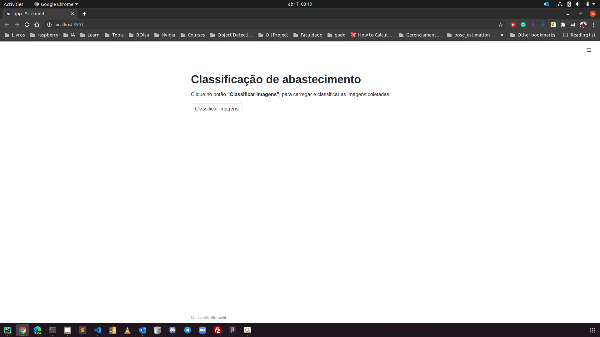
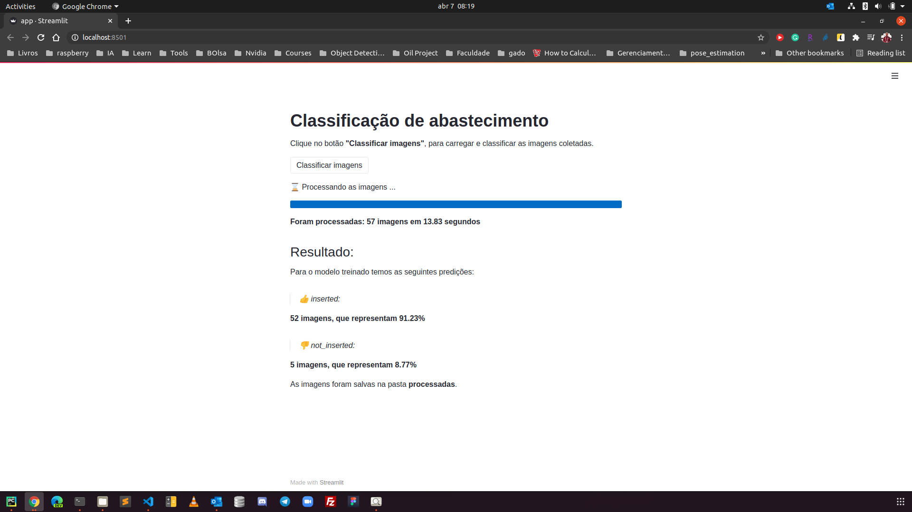
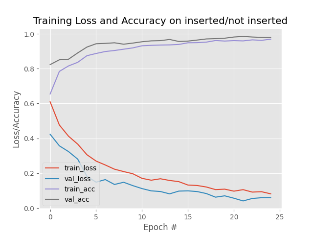

# :fuelpump: Supply App

**Objetivo:**

Aplicativo desenvolvido em **python**  com **streamlit**, para facilitar o processo de classificação e validação do modelo de abastecimento em campo.

**Dependências do projeto:**

É necessário instalar o **miniconda**, software o qual já tem o python e suas principais ferramentas para utilizar o aplicativo.

Acesse o link abaixo, e efetue o download da versão correta do miniconda para seu sistema operacional:

https://docs.conda.io/en/latest/miniconda.html

**Baixe a versão: Python 3.8**

Após instalado o miniconda,  abra o terminal e execute o comando abaixo para instalar as dependências do projeto:

	pip install  loguru Pillow streamlit numpy opencv-python imutils tensorflow

É necessário instalar o **tensorflow_runtime** com o seguinte comando:

	pip3 install --extra-index-url https://google-coral.github.io/py-repo/ tflite_runtime

**Execução:**

Para executar o aplicativo, abra o terminal na pasta do projeto e rode o seguinte comando:

	streamlit run https://raw.githubusercontent.com/GabrielMLB/streamlit-image-classification/main/app.py

Caso o navegador não abra automaticamente, clique no link abaixo para acessar o aplicativo:

<a href='http://localhost:8501/'>http://localhost:8501/</a>

Será exibida uma tela como essa:

Clique no botão classificar e suas imagens, serão processadas e salvas no diretório **"processadas"**.

Será exibida a seguinte tela:

**Treinamento do modelo:**

Abaixo temos o histórico de treinamento do modelo:

