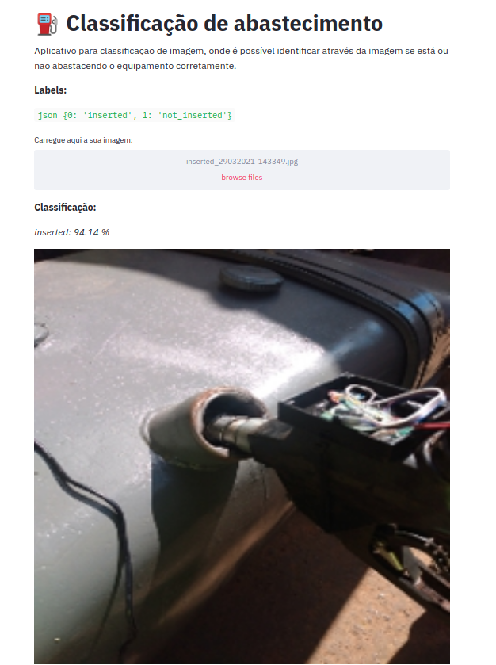

# :fuelpump: Image Classification  

**Streamlit & TFLite:**

Aplicativo desenvolvido para exemplicar a classificação de imagens com  **streamlit** e **tflite**.

**Dependências do projeto:**
	
	pip install -r requirements

Para executar o aplicativo basta rodar o seguinte comando:

	stramlit run app.py

